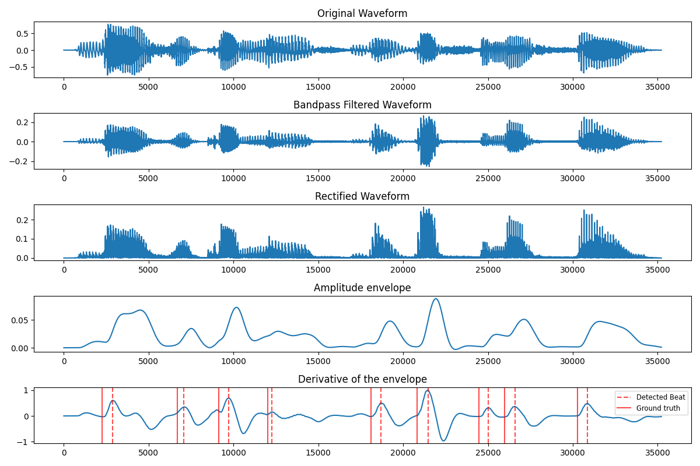

#  🥁 Vowel Beat Detector 🥁
This program is based on the beat measurement procedure as described by Cummins &amp; Port (1998). A beat is located at (roughly) the midpoint of every local rise in the derivative of the amplitude envelope of a waveform. The main script receives audio files as input and outputs arrays with timestamps of the detected beats.

# Basic procedure
This is an implementation of the following procedure, taken from Appendix A of Cummins & Port's Rhythmic constraints on stress timing in English (1998):

> The signal is bandpass filtered using a firstorder Butterworth filter centered at 1000 Hz and having a bandwidth of 600 Hz. Because of the shallow skirts of this filter, the net effect is to largely eliminate fricative noise and F0 energy, leaving energy in the formant regions intact. Informal trials with a range  of filters indicated that any procedure which achieved these dual goals would suffice. The resulting signal is rectified (using absolute values) and smoothed heavily, usually using another first order Butterworth filter, this time as a lowpass filter with a very low cutoff of about 10 Hz. The result of this stage is a smooth amplitude envelope. A beat is associated with every local rise in this envelope, and is defined as occuring at the point in time midway between the points where the local rise is 10% and 90% complete. This is similar to the heuristic used in Scott (1993), and serves to remove the effect of very gradual on- and offsets.

# Functionality
The `beat_detector` module provides the `BD` class. Objects created by instantiating this class can be configured with respect to filter design and peak detection properties and offer the base method for vowel beat detection. Additionally, it is possible to plot the byproducts of the procedure and play the filtered audio. Check out the files in the `notebooks` directory to explore these settings.

# Usage
1. **Clone this repository and install dependencies**
    ```
    git clone https://github.com/nnenufar/vowel_beat_detector.git
    cd vowel_beat_detector
    pip install -r requirements
    ```
2. **Set up input folder**

    All audio files must be contained inside the same folder:
    ```
    data/
    ├──audio1.wav
    ├──audio2.wav
    ├──audio3.wav
    ...
    
3. **Run main script**

    Required arguments:
    * `-in`: path to audio files input folder
    * `-out`: path to output files
    * `-r`: bandpass filter's right cutoff frequency
    * `-l`: bandpass filter's left cutoff frequency
    * `-sr`: audio sampling rate. Automatic resampling is performed if specified value is different from the audio's native sr
    
    Optional flag:
    * `-tg`: whether the output should be Praat .TextGrid files

    Example:
    
    ```
    python3 main.py -in <IN_PATH> -out <OUT_PATH> -l 800 -r 1500 -sr 16000
    ```

# Example


# Reference

```
@article{CUMMINS1998145,
title = {Rhythmic constraints on stress timing in English},
journal = {Journal of Phonetics},
volume = {26},
number = {2},
pages = {145-171},
year = {1998},
issn = {0095-4470},
doi = {https://doi.org/10.1006/jpho.1998.0070},
url = {https://www.sciencedirect.com/science/article/pii/S0095447098900705},
author = {Fred Cummins and Robert Port}
}
```

