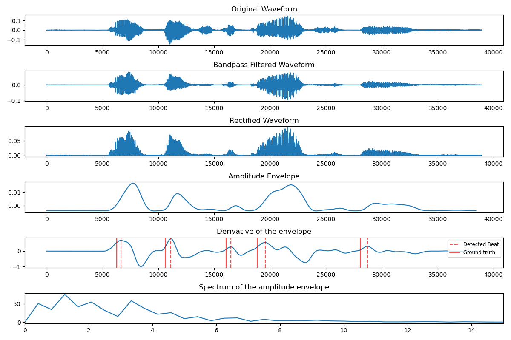

#  🥁 Vowel Beat Detector 🥁
This repository provides tools to analyze speech rhythm based on durational and spectral approaches:
* Vowel onset (beat) locations
* Low-frequency (amplitude envelope) spectrum

# Functionality
The `beat_detector` module provides the `BD` class. Objects created by instantiating this class can be configured with respect to filter design and onset detection properties and offer the base method for rhythmic feature extraction. Additionally, it is possible to plot the byproducts of the procedure and play the filtered audios.

# Usage
1. **Clone this repository and install dependencies**
    ```
    git clone https://github.com/nnenufar/vowel_beat_detector.git
    cd vowel_beat_detector
    pip install -r requirements.txt
    ```
2. **Set up input folder**

    All audio files must be contained inside the same folder:
    ```
    input_dir/
            audio/
                ├──audio1.wav
                ├──audio2.wav
                ├──audio3.wav
            textgrids_gt/ (optional)
                ├──audio1.TextGrid
    ```

    Each audio filename must be unique.
    
    Optionally, manually segmented textgrids can be included under `textgrids_gt`. If present, the provided annotations will be plotted alongside automatically detected ones when `-plt` is used. The ground truth textgrid must contain a point tier named `beats` and the filename must match the wav's.
    
3. **Run main script**

    Arguments:
    * `-in`: path to audio files input folder
    * `-out`: path to output files
    * `-r`: bandpass filter's right cutoff frequency
    * `-l`: bandpass filter's left cutoff frequency
    * `-sr`: audio sampling rate. Automatic resampling is performed if specified value is different from the audio's native sr
    
    Optional:
    * `-tg`: if used, textgrid will be saved in [output_dir]/textgrids
    * `-w`: if used, filtered audios will be saved in [output_dir]/filtered_wavs
    * `-plt`: if used, plots will be saved in [output_dir]/plots

    Example:
    
    ```
    python3 main.py -in <IN_PATH> -out <OUT_PATH> -l 800 -r 1500 -sr 16000 -plt
    ```

# Output format and loading
Outputs will be saved under the specified directory. Data is aggregated into `.parquet` files and indexed by filenames on the original input folder. Check `test/inspect_parquet` for an example on how to load the data.    

# Example


# References
* [A similar implementation using Praat](https://github.com/pabarbosa/prosody-scripts/tree/master/BeatExtractor)  

* Reference article:

```
@article{CUMMINS1998145,
title = {Rhythmic constraints on stress timing in English},
journal = {Journal of Phonetics},
volume = {26},
number = {2},
pages = {145-171},
year = {1998},
issn = {0095-4470},
doi = {https://doi.org/10.1006/jpho.1998.0070},
url = {https://www.sciencedirect.com/science/article/pii/S0095447098900705},
author = {Fred Cummins and Robert Port}
}

@article{gibbonRhythmsRhythm2023,
  title = {The Rhythms of Rhythm},
  author = {Gibbon, Dafydd},
  date = {2023-04},
  journaltitle = {Journal of the International Phonetic Association},
  shortjournal = {Journal of the International Phonetic Association},
  volume = {53},
  number = {1},
  pages = {233--265},
  doi = {10.1017/S0025100321000086},
  langid = {english}
}

@article{tilsenLowfrequencyFourierAnalysis2008,
  title = {Low-Frequency {{Fourier}} Analysis of Speech Rhythm},
  author = {Tilsen, Sam and Johnson, Keith},
  date = {2008-08-01},
  journaltitle = {The Journal of the Acoustical Society of America},
  volume = {124},
  number = {2},
  pages = {EL34-EL39},
  doi = {10.1121/1.2947626},
  langid = {english}
}
```

